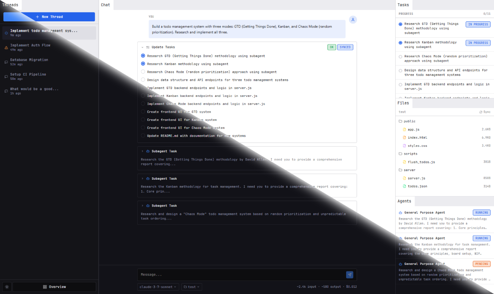

# omni

Omni is a harness that stays out of your way, compatible with LangGraph Agent Protocol: [Storybook](https://web-harness.github.io/omni/).

[](https://web-harness.github.io/omni/)

- [structure](#structure)
- [development](#development)
- [runtime](#runtime)
- [status](#status)

## structure

- [`omni-ui/`](./omni-ui) — Main UI, compiled to WebAssembly and served as a static site. Contains the main UI logic, components, and state management.
- [`omni-rt/crates/`](./omni-rt/crates) — Rust runtime crates for protocol handling, file system, deep agents, and WebAssembly bindings to existing libraries.
- [`omni-rt/packages/`](./omni-rt/packages) — Pure JavaScript and TypeScript runtime packages consumed by the UI build.
- [`omni-wc/`](./omni-wc) — Web Components version of the harness UI, for embedding in other applications.

## development

Project uses [Moon](https://moonrepo.dev/) as a build system and task runner. The following npm shortcuts are available to start working with Moon:

```
# install dependencies
npm ci

# start development server with hot reload
npm run dev

# run tests
npm run test

# format code
npm run format

# build for production
npm run build
```

## runtime

The Omni runtime is meant to be a reference implementation of the environment needed for the Agent Protocol and harness to be useful in. It includes Rust crates under [`omni-rt/crates/`](./omni-rt/crates) and pure Typescript packages under [`omni-rt/packages/`](./omni-rt/packages). The Typescript components are exposed as Web Components and consumed back in Dioxus and Rust.

## status

- [x] Full replica of the original [OpenWork](https://github.com/web-harness/openwork) UI in the Dioxus framework.
- [x] Improved dock management with [DockView](https://github.com/mathuo/dockview).
- [x] Improved Markdown viewer with [Marked](https://github.com/markedjs/marked).
- [x] Improved PDF viewer with [PDF.js](https://www.npmjs.com/package/pdfjs-dist).
- [x] Improved code viewer with [Monaco Editor](https://www.npmjs.com/package/monaco-editor).
- [x] Improved media viewer with [Plyr](https://www.npmjs.com/package/plyr).
- [x] Improved spreadsheet viewer with [SheetJS](https://sheetjs.com/).
- [x] Improved DOCX viewer with [docxjs](https://github.com/VolodymyrBaydalka/docxjs).
- [x] Improved PowerPoint viewer with [pptx-renderer](https://github.com/aiden0z/pptx-renderer).
- [x] Improved dialog system with [Popper.js](https://www.npmjs.com/package/@popperjs/core).
- [x] Reusability with Storybook integration and Web Component export.
- [x] Automatic client generation for the Agent Protocol.
- [x] ZenFS integration for file system access.
- [x] Bashkit integration for sandbox shell access.
- [x] Deep Agent integration as harness' main agent loop.
- [x] Full compatibility with the Agent Protocol through Service Workers.
- [x] [Moon](https://moonrepo.dev/) for fast builds and convenient developer experience.
- [ ] Auto UI mocking via auto openapi mocking with [Mockoon](https://github.com/mockoon/mockoon).
- [ ] Comprehensive test suite with unit, integration, and E2E tests.
